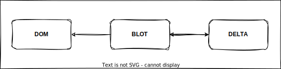

# The Introduction of Quill Rich-Text Editor

## Overall Architecture



It's the basic way of how Quill run in the browser. DOM only can be drived, you should not change it, althought this behaviour also works, but it's not recommonded in the development. The Blots and Delta are work for each other, whenever one is changed, another will be updated.

## What is Delta?

It'a data structure which is representative of editor's content, it can be stored in the database or somewhere else, and will be render to DOM content through the Scroll blot(the top blot which control the blot tree).

This is the [formal doc](www.github.com/quilljs/delta), it shows the very specific doc, you can get detials of how an api used. Here we introduce some normal api briefly reference to the delta structure.

**Insert**, **Retain**, **Delete** are three operations of delta, **Retain** and **Delete**'s value are number, mean where you will start your next operation and the length you are going to delete respectivly. The value of **Insert** is either String which simply represent the text with another optinal property `attributer` or an Object which represent embed element, such as image, video.

So you can use the above three operations to apply the Delta.

## What about the Blot?

Every element in the editor are all Blot type, such as text, code, image, or formula. 

Quill has provided some normal useful blots you can use, and also you can make a customize blot which often inherit from the basic blot in the Quill. This feature is very strong to customize your own editor.

## Module, it's just like plugin, injected into Quill, and work.

```javascript
const Module = Quill.import('core/module');

// code your module
class YourModule extends Module {
	constructor(quill, options) {
		super(quill, options);
	}
}

// register it into the Quill
Quill.register({
	'modules/yourModuleName': YourModule
});

// use it when initialize the Quill
new Quill(
	{
		modules: {
			yourModuleName: true | options
		}
	}
)
```

You can use it like the code above, it also can strength your editor.