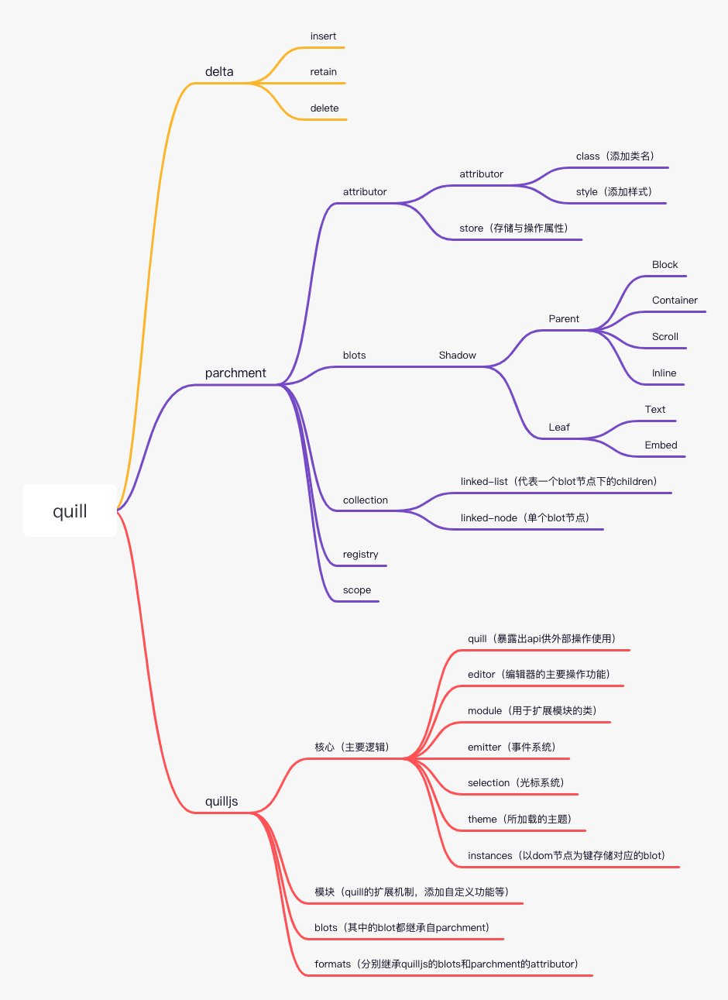

# 基于[Quill](quilljs.com)扩展的研报编辑器
## 参考文章
- [QuillJS编辑器源码学习](zhuanlan.zhihu.com/p/374592382)
- [深入浅出Quill](juejin.cn/post/6844904073620094990)
## quill,delta,parchment的基础结构  

## 自定义容器基本设计
由于quill自带的元素嵌套功能是写死在代码里面的，也就是说一个容器内部的元素是固定的，文档中不可能去自定义编辑；由此就需要设计一个可以在文档中自由填入不同内容的容器，实现的方案与quill自带的容器嵌套调用的api是一样的，只是嵌套的规则不同。
核心是建立一个自定义的blot，围绕这个blot去展开实现自定义容器的功能；这个blot的name叫‘container-flag’,在新建一个新的容器的时候把新建的容器的名称传进去就可以实现一个自定义的容器了。

	new Delta.insert('container-flag', {container: 'yourContainerBlotName'})

这样就能在文档中插入一个你自定义的容器了。实现的方案简要描述为在flag（container-flag简称）的节点上记录该容器的所有信息，这些是需要存储在delta上保存下来的，信息中有2个属性分别为childlength和prevlength，是实现的关键属性，在渲染delta数据的过程中，使用深度优先算法，通过优化的递归（可截停，浅调用栈）去查询当前节点所属的容器，然后将该节点加入到容器内。

目前基于此方案是实现的容器有：分页、分栏、自定义文本框、页眉页脚等，总之可以相对灵活的实现一些带有特殊功能的容器。

- 编辑器在实例化的时候会默认创建一个子节点,实现代码位于ParentBlot的optimize方法中
```
	省略...
    if (this.children.length === 0) {
      if (this.statics.defaultChild != null) {
		// 当前节点无子节点时会创建一个DOM节点
        const child = this.scroll.create(this.statics.defaultChild.blotName);
        this.appendChild(child);
        // TODO double check if necessary
        // child.optimize(context);
      } else {
        this.remove();
      }
    }
```