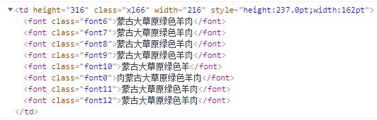

## 格式
- 字体
  - 背景色、颜色、字体、大小、加粗、斜体、下划线(单)
- 对齐方式
  - 水平对齐、垂直对齐

## 设计
1. 提取样式（标签、类名）
  ```
  {
    td: {
      color: 'red'
    },
    font6: {
      font-size: '24.0pt'
    }
  }
  ```
2. 提取标签，检查单个标签（标签样式、属性、class-匹配提取的类名、style）
  
3. 将匹配到的单个样式对应到编辑器内的格式，应用到单元格